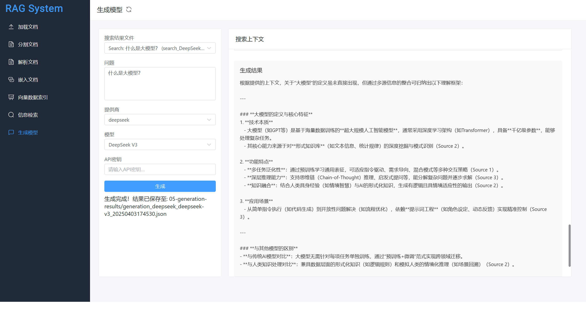

# 手工制作一个RAG框架

一个从零开始实现的 RAG (Retrieval Augmented Generation) 系统，不依赖现有的 RAG 框架。该项目旨在提供一个轻量级、可定制的知识库问答解决方案。



## 项目概述

本项目是一个完全自主实现的 RAG 系统，通过将文档分块、向量化存储、相似度检索等核心功能模块化实现，使用户能够构建自己的知识库问答系统。

### 核心特性

- 文档分块：支持自定义大小的文档分块策略
- 向量化存储：将文本块转换为向量并高效存储
- 相似度检索：基于向量相似度进行智能匹配
- 无框架依赖：不依赖 LangChain 等重量级 RAG 框架
- 跨平台支持：同时支持 Windows 和 Ubuntu 环境

## 部署安装

### 拉取代码

你可以通过克隆此仓库到你的本地机器来开始：

```shell
git clone https://github.com/yilane/ragdev-project.git
```

然后导航至目录，并按照部署前端或后端的指示开始操作。

### 部署前端 (Ubuntu) 

#### 1. 检查是否已安装 npm：

- 进入前端项目目录（例如 `cd frontend/`）。
- 在终端中运行命令：`npm -v`
- 如果已安装，将显示 npm 的版本号。

#### 2. 安装 Node.js 和 npm：

- 更新 apt 软件包列表：`sudo apt update`
- 安装 Node.js 和 npm：`sudo apt install nodejs npm -y`
- **备注**：项目中使用的`node`版本为`v22.14.0` ， `npm`版本为`10.9.2`

#### 3. 安装前端组件：

- 运行 `npm install` 命令来安装项目依赖的前端组件。

#### 4. 运行前端组件：

修改`frontend/src/config/api.js`中的代码环境地址`apiBaseUrl`

```bash
const config = {
  development: {
    baseUrl: 'http://localhost:8001'
  },
  production: {
    baseUrl: 'http://api.example.com'
  },
  test: {
    baseUrl: 'http://localhost:8001'
  }
}
```

运行 `npm run dev` 命令来安装项目依赖的前端组件。

```bash
# 默认是 development 环境
npm run dev

# 或者指定环境
npm run dev --mode production
```

### 部署后端 (Ubuntu) 

本项目使用 Python v3.10 开发，完整 Python 依赖软件包见requirements_ubun.txt 和 requirements_win.txt。

- Windows 环境： [requirements_win.txt](https://github.com/yline007/ragdev-project/blob/main/requirements_win.txt)
- Ubuntu 环境： [requirements_ubun.txt](https://github.com/yline007/ragdev-project/blob/main/requirements_ubun.txt)

关键依赖的官方文档如下：

- Python 环境管理 [Miniconda](https://docs.conda.io/projects/miniconda/en/latest/)

#### 1. 安装 Miniconda

```shell
mkdir -p ~/miniconda3
wget https://repo.anaconda.com/miniconda/Miniconda3-latest-Linux-x86_64.sh -O ~/miniconda3/miniconda.sh
bash ~/miniconda3/miniconda.sh -b -u -p ~/miniconda3
rm -rf ~/miniconda3/miniconda.sh
```

安装完成后，建议新建一个 Python 虚拟环境，命名为 `rag-project`。

```shell
# 创建虚拟环境
conda create -n rag-project python=3.11

# 激活环境
conda activate rag-project 
```

#### 2. 安装后端依赖：

```
pip install -r requirements_ubun.txt
```

#### 3. 配置 Model API Key
在项目根目录下创建 `.env` 文件，配置相关的 API Key。您可以参考 `.env.example` 文件进行配置：

```shell
OPENAI_API_KEY=your_openai_api_key_here
DEEPSEEK_API_KEY=your_deepseek_api_key_here
```

#### 4. 启动后端

上述开发环境安装完成后，使用start_server.py启动后端服务

```shell
# 进入后端项目目录
cd backend

# 后端服务相关命令

# 普通启动（前台运行）
python start_server.py start

# 后台运行
python start_server.py start -d

# 禁用自动重载启动
python start_server.py start --no-reload

# 后台运行且禁用自动重载
python start_server.py start -d --no-reload

# 停止服务
python start_server.py stop

# 重启服务
python start_server.py reload
```

*(请确保您的后端主文件是 `main.py` 并且 FastAPI 应用实例名为 `app`。如果端口 `8001` 被占用，可通过.env配置文件更换为其他可用端口。)*


## 技术架构

### 技术栈
- 后端框架：Python FastAPI
- 向量数据库：Milvus、Chroma
- 前端技术栈：Vue3 + Vite
- 后端语言：Python 

## 项目架构 

### 整体项目结构
```
.
├── backend/               # 后端项目目录
├── frontend/              # 前端项目目录
├── requirements_ubun.txt  # Ubuntu环境依赖
├── requirements_win.txt   # Windows环境依赖
└── README.md              # 项目说明文档
```

### 后端项目架构 
```
backend/
├── main.py                # 主入口文件
├── services/              # 服务层目录
│   ├── archive/          # 归档服务目录
│   ├── chunking_service.py    # 文本分块服务
│   ├── embedding_service.py   # 文本嵌入服务
│   ├── generation_service.py  # 内容生成服务
│   ├── loading_service.py     # 数据加载服务
│   ├── parsing_service.py     # 文本解析服务
│   ├── search_service.py      # 搜索服务
│   └── vector_store_service.py # 向量存储服务
├── utils/                # 工具目录
├── logs/                # 日志目录
├── temp/                # 临时文件目录
├── 01-loaded-docs/      # 原始文档存储目录
├── 01-chunked-docs/     # 分块后文档存储目录
├── 02-embedded-docs/    # 向量化后文档存储目录
├── 03-vector-store/     # 向量数据库存储目录
├── 04-search-results/   # 搜索结果存储目录
└── 05-generation-results/ # 生成结果存储目录
```

### 前端项目架构 
```
frontend/
├── public/            # 静态资源目录
├── src/               # 源代码目录
│   ├── assets/        # 项目资源文件(图片、字体等)
│   ├── components/    # 可复用的Vue组件
│   ├── router/        # 路由配置
│   ├── store/         # 状态管理
│   ├── views/         # 页面级组件
│   ├── App.vue        # 根组件
│   └── main.js        # 应用入口文件
├── index.html         # 项目HTML模板
├── package.json       # 项目依赖和脚本配置
├── vite.config.js     # Vite构建工具配置
├── tailwind.config.js # Tailwind CSS配置
└── postcss.config.js  # PostCSS配置
```

## 常见部署异常问题

### 前端部署相关

1. **Node.js 版本不兼容**
   - 问题：项目启动失败，出现依赖包安装错误
   - 解决：确保使用 Node.js v22.14.0 和 npm v10.9.2 版本
   - 建议：使用 nvm 管理 Node.js 版本

2. **跨域访问问题**
   - 问题：前端无法访问后端 API，报 CORS 错误
   - 解决：检查 `frontend/src/config/api.js` 中的 `apiBaseUrl` 配置
   - 建议：确保后端已正确配置 CORS 允许的域名

3. **页面样式异常**
   - 问题：页面布局混乱，样式不生效
   - 解决：检查是否正确安装了 Element Plus 和 Tailwind CSS
   - 建议：执行 `npm install` 重新安装依赖

### 后端部署相关

1. **Python 环境问题**
   - 问题：ImportError 或模块未找到错误
   - 解决：使用 Python 3.10 版本，并确保正确安装 requirements.txt 中的依赖
   - 建议：使用虚拟环境隔离项目依赖

2. **API Key 未配置错误**
   - 错误信息：`OpenAI API key not provided` 或 `Deepseek API key not provided`
   - 解决方案：检查 `.env` 文件中是否正确配置了对应的 API Key

3. **API Key 无效错误**
   - 错误信息：`Invalid API key` 或 `Authentication failed`
   - 解决方案：
     - 确认 API Key 是否正确复制，没有多余的空格
     - 检查 API Key 是否仍然有效
     - 确认是否有足够的额度

4. **找不到 .env 文件错误**
   - 错误信息：`Could not find .env file`
   - 解决方案：确保在 `backend` 目录下创建了 `.env` 文件 

5. **端口占用问题**
   - 问题：启动服务时提示端口被占用
   - 解决：修改启动命令中的端口号
      ```bash
      uvicorn main:app --reload --port 8002 --host 0.0.0.0
      ```
   - 建议：使用 `lsof -i :端口号` 检查端口占用情况

6. **文件权限问题**
   - 问题：无法读写文件，Permission denied
   - 解决：检查文件和目录权限
      ```bash
      chmod -R 755 项目目录
      ```
   - 建议：确保运行服务的用户有适当的文件权限

### 数据处理相关

1. **大文件处理超时**
   - 问题：处理大型文档时请求超时
   - 解决：调整 Nginx 和 uvicorn 的超时设置
   - 建议：对大文件进行分批处理

2. **内存溢出**
   - 问题：处理大量向量数据时内存不足
   - 解决：调整批处理大小，增加服务器内存
   - 建议：监控服务器资源使用情况

3. **向量数据库连接问题**
   - 问题：无法连接到向量数据库
   - 解决：检查数据库配置和连接参数
   - 建议：确保数据库服务正常运行

### 监控和日志

1. **日志记录**
   - 建议开启详细日志记录，便于问题排查，配置.env文件
      ```bash
      DEBUG=True
      ```

2. **性能监控**
   - 建议使用监控工具跟踪服务性能
   - 定期检查系统资源使用情况

### 更新和维护

1. **版本更新**
   - 定期更新依赖包版本
   - 注意查看更新日志，避免破坏性更新

2. **数据备份**
   - 定期备份向量数据库
   - 保存重要的配置文件

如遇到其他问题，请查看项目 Issue 或提交新的 Issue。

