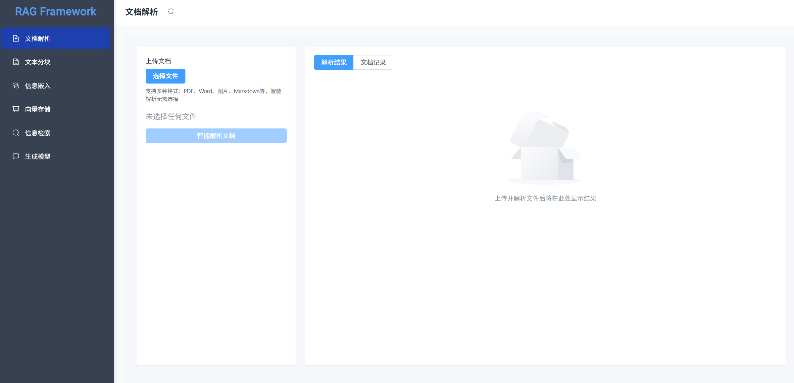

# 🚀 手工制作一个RAG框架

一个从零开始实现的 RAG (Retrieval Augmented Generation) 系统，不依赖现有的 RAG 框架。该项目旨在提供一个轻量级、可定制的知识库问答解决方案。



## 🎯 项目概述

本项目是一个完全自主实现的 RAG 系统，通过将文档解析、分块、向量化存储、相似度检索、智能生成等核心功能模块化实现，使用户能够构建自己的知识库问答系统。

### ✨ 核心特性

- **🔍 智能文档解析**：支持多种文档格式（PDF、DOCX、TXT等），集成marker-pdf、surya-ocr等先进解析工具
- **🌐 网页内容抓取**：基于trafilatura的专业级网页内容提取，支持多种输出格式和智能清理
- **📝 灵活文档分块**：支持多种分块策略，可自定义分块大小
- **🧠 多模型支持**：支持OpenAI、DeepSeek、HuggingFace等多种AI模型提供商
- **📊 多向量数据库**：同时支持Milvus和ChromaDB向量数据库
- **⚡ 高性能检索**：基于向量相似度的智能匹配和检索
- **🎨 现代化UI**：基于Vue3 + Element Plus的优雅前端界面
- **🔧 无框架依赖**：核心功能完全自主实现，不依赖LangChain等重量级RAG框架
- **🌐 跨平台支持**：同时支持Windows和Ubuntu环境

### 🏗️ 技术架构

**后端技术栈：**
- Python 3.11 + FastAPI
- 向量数据库：Milvus、ChromaDB
- AI模型：OpenAI GPT、DeepSeek、HuggingFace模型
- 文档解析：marker-pdf、surya-ocr、pypdf、pymupdf等
- 网页抓取：trafilatura、selectolax、feedparser等
- 机器学习：PyTorch、sentence-transformers

**前端技术栈：**
- Vue 3.5 + Vite 6.2
- Element Plus 2.9 + Tailwind CSS 4.1
- Axios + Pinia状态管理

## 📦 安装部署

### 🔽 获取代码

```bash
git clone https://github.com/yilane/rag-framework.git
cd rag-framework
```

### 🖥️ 后端部署

#### 1. 环境要求

- **Python**: 3.10+ (推荐3.10.18)
- **系统**: Ubuntu 22.04 / Windows 10+ / macOS

#### 2. 安装Miniconda（推荐）

**Ubuntu/macOS:**
```bash
mkdir -p ~/miniconda3
wget https://repo.anaconda.com/miniconda/Miniconda3-latest-Linux-x86_64.sh -O ~/miniconda3/miniconda.sh
bash ~/miniconda3/miniconda.sh -b -u -p ~/miniconda3
rm -rf ~/miniconda3/miniconda.sh
```

**Windows:**
访问 [Miniconda官网](https://docs.conda.io/projects/miniconda/en/latest/) 下载安装包

#### 3. 创建虚拟环境

```bash
# 创建虚拟环境
conda create -n rag-framework python=3.10

# 激活环境
conda activate rag-framework 
```

#### 4. 安装依赖

```bash
# 安装项目依赖
pip install -r requirements.txt

# 验证依赖是否正确安装
pip check
```

> **注意**: 如果遇到依赖冲突，这通常不会影响核心功能，可以继续使用。

#### 5. 配置API密钥

在项目根目录创建 `.env` 文件：

```bash
# OpenAI配置
OPENAI_API_KEY=your_openai_api_key_here

# DeepSeek配置  
DEEPSEEK_API_KEY=your_deepseek_api_key_here

# HuggingFace配置（可选）
HUGGINGFACE_API_KEY=your_huggingface_api_key_here

# 日志配置
LOG_LEVEL=INFO
LOG_DIR=logs
LOG_RETENTION_DAYS=30
```

#### 6. 启动后端服务

```bash
cd backend

# 方法1：直接启动（推荐）
uvicorn main:app --reload --host 0.0.0.0 --port 8003

# 方法2：生产环境启动
uvicorn main:app --host 0.0.0.0 --port 8003 --workers 1

# 方法3：后台运行
nohup uvicorn main:app --host 0.0.0.0 --port 8003 > logs/server.log 2>&1 &
```

### 🌐 前端部署

#### 1. 环境要求

- **Node.js**: v22.14.0+
- **npm**: v10.9.2+

#### 2. 安装Node.js

**Ubuntu:**
```bash
sudo apt update
sudo apt install nodejs npm -y

# 或使用nvm管理版本
curl -o- https://raw.githubusercontent.com/nvm-sh/nvm/v0.39.0/install.sh | bash
nvm install 22.14.0
nvm use 22.14.0
```

#### 3. 安装前端依赖

```bash
cd frontend
npm install
```

#### 4. 配置API地址

修改 `frontend/src/config/api.js` 中的API地址：

```javascript
const config = {
  development: {
    baseUrl: 'http://localhost:8003'  // 确保与后端端口一致
  },
  production: {
    baseUrl: 'http://your-domain.com'
  }
}
```

#### 5. 启动前端服务

```bash
# 开发环境
npm run dev

# 生产环境构建
npm run build

# 预览构建结果
npm run preview
```

## 📁 项目架构

### 整体项目结构
```
rag-framework/
├── backend/                    # 后端项目目录
│   ├── main.py                # FastAPI主入口文件
│   ├── services/              # 核心服务模块
│   │   ├── parsing_service.py     # 文档解析服务（marker-pdf, surya-ocr）
│   │   ├── web_scraping_service.py # 网页抓取服务（trafilatura）
│   │   ├── loading_service.py     # 文档加载服务
│   │   ├── chunking_service.py    # 文本分块服务
│   │   ├── embedding_service.py   # 文本向量化服务
│   │   ├── vector_store_service.py # 向量数据库服务
│   │   ├── search_service.py      # 检索搜索服务
│   │   └── generation_service.py  # AI生成服务
│   ├── utils/                 # 工具模块
│   │   ├── config.py              # 配置管理
│   │   └── logger.py              # 日志管理
│   ├── 01-loaded-docs/        # 原始文档存储
│   ├── 01-parsed-docs/        # 解析后文档存储
│   ├── 01-chunked-docs/       # 分块后文档存储
│   ├── 02-embedded-docs/      # 向量化文档存储
│   ├── 03-vector-store/       # 向量数据库文件
│   ├── 04-search-results/     # 检索结果存储
│   ├── 05-generation-results/ # 生成结果存储
│   ├── logs/                  # 系统日志
│   └── temp/                  # 临时文件
├── frontend/                   # 前端项目目录
│   ├── src/                   # 源代码
│   │   ├── components/            # Vue组件
│   │   ├── views/                 # 页面组件
│   │   ├── router/                # 路由配置
│   │   ├── config/                # 配置文件
│   │   ├── utils/                 # 工具函数
│   │   └── assets/                # 静态资源
│   ├── public/                # 公共资源
│   └── dist/                  # 构建产物
├── docs/                       # 项目文档
├── images/                     # 项目图片
├── requirements.txt            # Python依赖
└── README.md                   # 项目说明
```

### 核心服务模块说明

| 服务模块 | 功能描述 | 主要技术 |
|---------|---------|---------|
| **parsing_service** | 文档解析与OCR | marker-pdf、surya-ocr、pypdf |
| **web_scraping_service** | 网页内容抓取 | trafilatura、selectolax、feedparser |
| **loading_service** | 文档加载与预处理 | 多格式文档读取 |
| **chunking_service** | 文本智能分块 | 自定义分块策略 |
| **embedding_service** | 文本向量化 | OpenAI、HuggingFace嵌入模型 |
| **vector_store_service** | 向量数据库管理 | Milvus、ChromaDB |
| **search_service** | 向量检索搜索 | 相似度检索、混合检索 |
| **generation_service** | AI回答生成 | OpenAI GPT、DeepSeek |

## 🚀 快速开始

### 1. 获取文档
- 访问前端界面：`http://localhost:5173`
- **上传文档**：在"文档解析"页面选择PDF/DOCX文件并选择解析方式
- **网页抓取**：在"文档解析"页面输入网页URL，支持智能内容提取

### 2. 文档处理
- 在"文档处理"页面进行分块配置
- 选择向量化模型（OpenAI、HuggingFace）
- 执行向量化和索引建立

### 3. 智能问答
- 在"智能问答"页面输入问题
- 选择AI模型（GPT-4、DeepSeek等）
- 获取基于知识库的智能回答

## 🔧 API接口

### 文档处理接口

```bash
# 上传解析文档
POST /parse
Content-Type: multipart/form-data

# 网页内容抓取
POST /web-scraping/scrape
Content-Type: application/json

# 批量网页抓取
POST /web-scraping/batch-scrape
Content-Type: application/json

# 文档分块
POST /chunk
Content-Type: application/json

# 文档向量化
POST /embed
Content-Type: application/json

# 建立索引
POST /index
Content-Type: application/json
```

### 检索生成接口

```bash
# 检索相关文档
POST /search
Content-Type: application/json

# 生成AI回答
POST /generate
Content-Type: application/json

# 获取可用模型
GET /generation/models
```

### 管理接口

```bash
# 获取文档列表
GET /documents

# 获取向量数据库集合
GET /collections/{provider}

# 健康检查
GET /health
```

## ⚙️ 配置选项

### 向量数据库配置

在 `backend/utils/config.py` 中配置：

```python
# Milvus配置
MILVUS_CONFIG = {
    "uri": "03-vector-store/langchain_milvus.db",
    "index_types": ["FLAT", "IVF_FLAT", "HNSW"],
    "metric_type": "L2"
}

# ChromaDB配置  
CHROMA_CONFIG = {
    "uri": "03-vector-store/langchain_chroma.db",
    "distance_function": "cosine"
}
```

### AI模型配置

支持的模型提供商：

- **OpenAI**: GPT-4, GPT-3.5-turbo, text-embedding-ada-002
- **DeepSeek**: deepseek-v3, deepseek-r1（支持思维链）
- **HuggingFace**: sentence-transformers系列模型

## 🚨 常见问题解决

### 后端问题

**1. API密钥配置错误**
```bash
# 检查.env文件是否正确配置
cat backend/.env

# 确保密钥有效且有足够额度
```

**2. 端口被占用**
```bash
# 查看端口占用情况
lsof -i :8003

# 更换端口启动
uvicorn main:app --port 8002
```

**3. 依赖安装失败**
```bash
# 清理缓存重新安装
pip cache purge
pip install -r requirements.txt --no-cache-dir

# 使用镜像源
pip install -r requirements.txt -i https://pypi.tuna.tsinghua.edu.cn/simple/

# 检查依赖冲突
pip check
```

**4. 网页抓取超时**
```bash
# 前端已设置10分钟超时，大文档需要更长时间
# 如果仍然超时，可以分批处理较小的网页
```

### 前端问题

**1. Node.js版本不兼容**
```bash
# 使用nvm管理版本
nvm install 22.14.0
nvm use 22.14.0
```

**2. 依赖安装错误**
```bash
# 清理重新安装
rm -rf node_modules package-lock.json
npm install
```

**3. 跨域问题**
```bash
# 检查API地址配置
grep -r "baseUrl" frontend/src/config/
```

### 性能优化建议

**1. 大文件处理**
- 调整分块大小：推荐1000-2000字符
- 使用批量处理：避免单次处理过大文件
- 增加超时时间：修改前端axios timeout配置

**2. 向量数据库优化**
- Milvus：使用HNSW索引提升检索速度
- ChromaDB：启用并行处理提升性能

**3. 内存管理**
```bash
# 监控内存使用
htop

# 限制torch线程数
export OMP_NUM_THREADS=4
```

## 📊 系统监控

### 日志查看
```bash
# 查看系统日志
tail -f backend/logs/app.log

# 查看错误日志
grep -i error backend/logs/app.log
```

### 性能监控
```bash
# 检查GPU使用情况（如果有）
nvidia-smi

# 检查磁盘使用
df -h

# 检查内存使用
free -h
```

## 🤝 贡献指南

欢迎提交Issue和Pull Request来改进项目！

### 开发环境设置
1. Fork项目到个人仓库
2. 创建特性分支：`git checkout -b feature/amazing-feature`
3. 提交更改：`git commit -m 'Add amazing feature'`
4. 推送分支：`git push origin feature/amazing-feature`
5. 创建Pull Request

## 📄 许可证

本项目采用MIT许可证，详见 [LICENSE](LICENSE) 文件。

## 🙏 致谢

感谢以下开源项目的支持：
- [FastAPI](https://fastapi.tiangolo.com/)
- [Vue.js](https://vuejs.org/)
- [Element Plus](https://element-plus.org/)
- [Milvus](https://milvus.io/)
- [ChromaDB](https://www.trychroma.com/)
- [marker-pdf](https://github.com/VikParuchuri/marker)
- [surya-ocr](https://github.com/VikParuchuri/surya)
- [trafilatura](https://github.com/adbar/trafilatura)
- [OpenAI](https://openai.com/)
- [HuggingFace](https://huggingface.co/)

---

如有问题，请查看 [Issues](https://github.com/yilane/rag-framework/issues) 或提交新的Issue。

